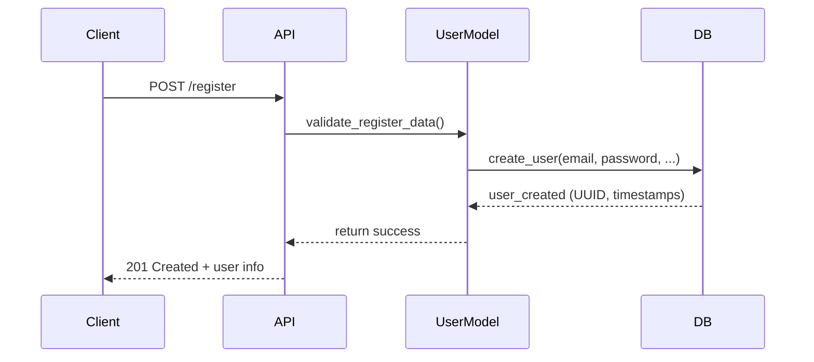
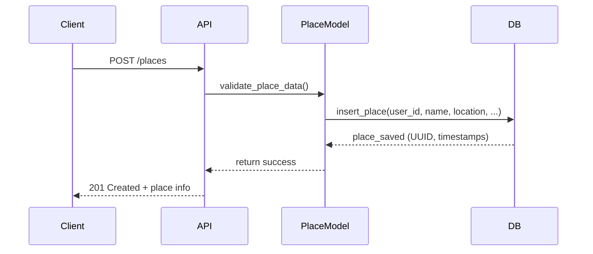
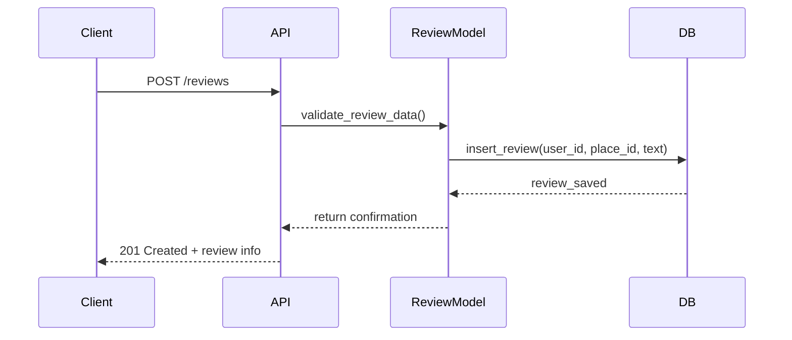
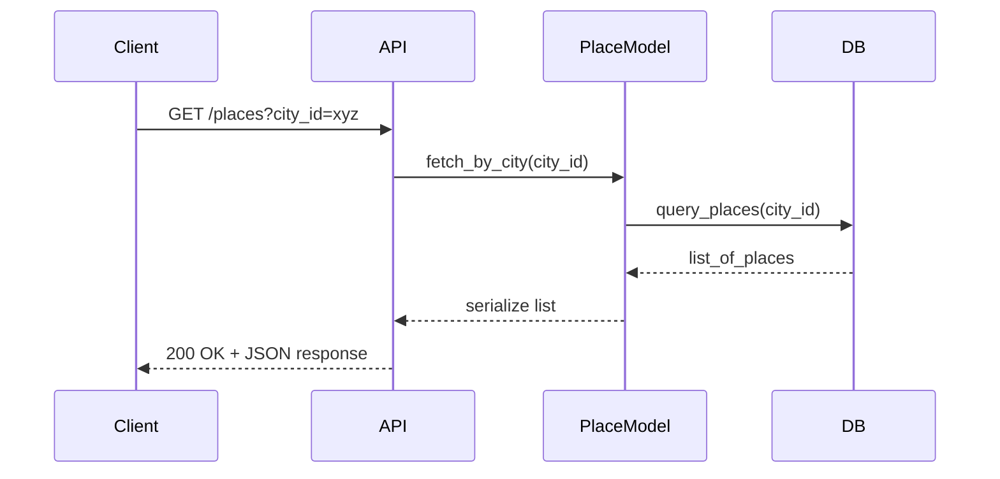

# API Sequence Diagrams

```mermaid
sequenceDiagram
    participant Client
    participant API
    participant UserModel
    participant DB

    Client->>API: POST /register
    API->>UserModel: validate_register_data()
    UserModel->>DB: create_user(email, password, ...)
    DB-->>UserModel: user_created (UUID, timestamps)
    UserModel-->>API: return success
    API-->>Client: 201 Created + user info
```

```mermaid
sequenceDiagram
    participant Client
    participant API
    participant PlaceModel
    participant DB

    Client->>API: POST /places
    API->>PlaceModel: validate_place_data()
    PlaceModel->>DB: insert_place(user_id, name, location, ...)
    DB-->>PlaceModel: place_saved (UUID, timestamps)
    PlaceModel-->>API: return success
    API-->>Client: 201 Created + place info
```

```mermaid
sequenceDiagram
    participant Client
    participant API
    participant ReviewModel
    participant DB

    Client->>API: POST /reviews
    API->>ReviewModel: validate_review_data()
    ReviewModel->>DB: insert_review(user_id, place_id, text)
    DB-->>ReviewModel: review_saved
    ReviewModel-->>API: return confirmation
    API-->>Client: 201 Created + review info
```

```mermaid
sequenceDiagram
    participant Client
    participant API
    participant PlaceModel
    participant DB

    Client->>API: GET /places?city_id=xyz
    API->>PlaceModel: fetch_by_city(city_id)
    PlaceModel->>DB: query_places(city_id)
    DB-->>PlaceModel: list_of_places
    PlaceModel-->>API: serialize list
    API-->>Client: 200 OK + JSON response
```

