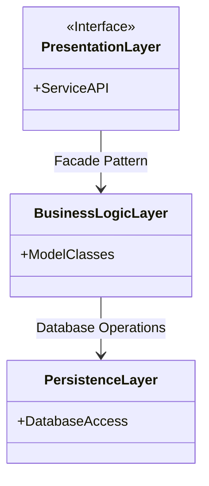
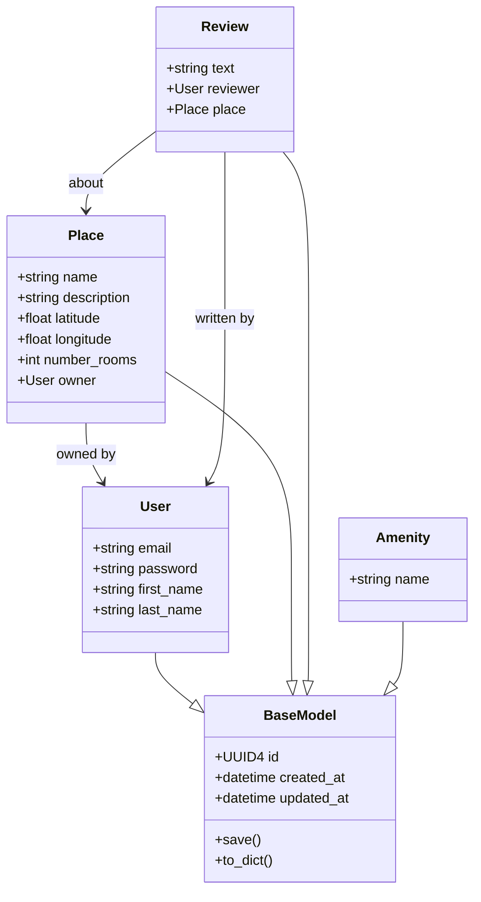
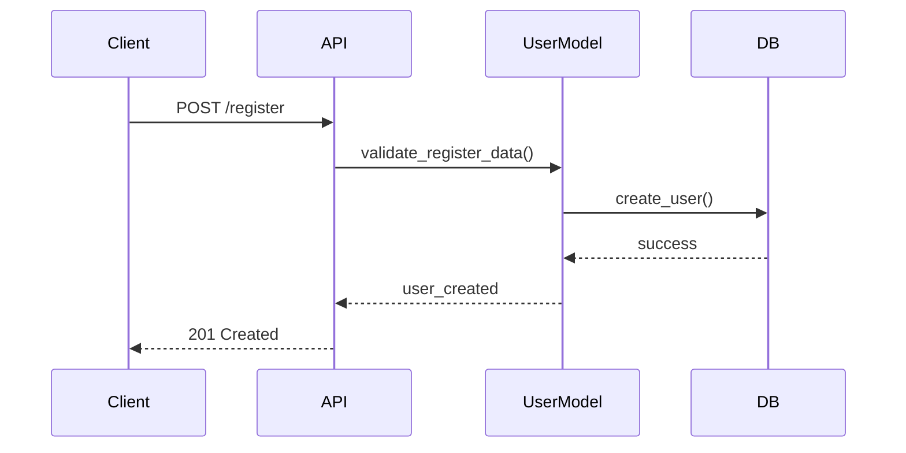
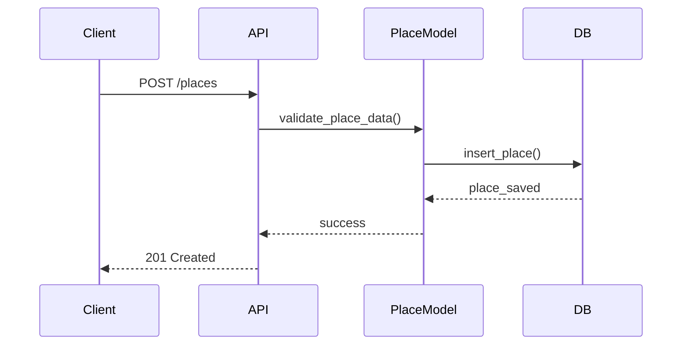
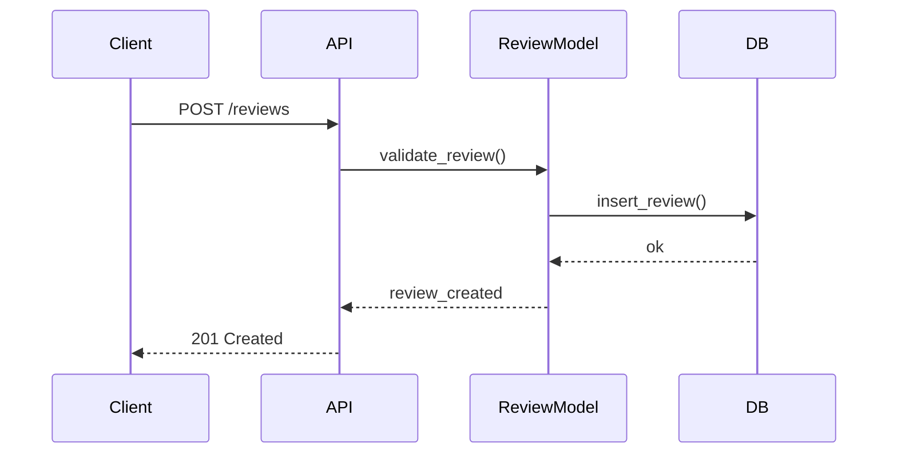
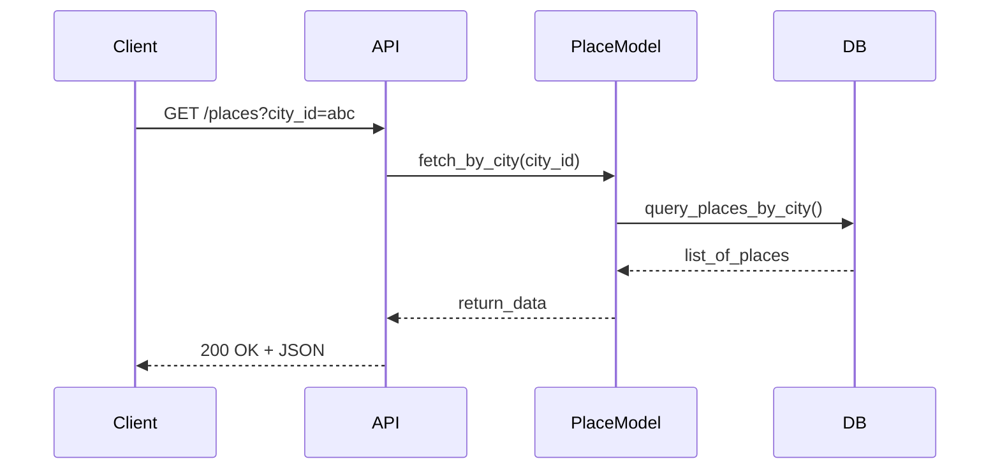

# HBnB Architecture Documentation

**Author:** Ahmed

---

## 📘 Introduction

This document provides a complete technical overview of the HBnB application as part of Part 1 of the Holberton School project. It consolidates all architecture and design documentation, including:

1. High-Level Package Diagram
2. Detailed Class Diagram for the Business Logic Layer
3. Sequence Diagrams for API Calls
4. Explanatory Notes for each component

The purpose of this document is to offer a clear blueprint for the system’s design, facilitating future development and maintenance.

---

## 🧱 0. High-Level Package Diagram

### 📊 Diagram (Mermaid.js)

### 🧾 Explanation

* **Presentation Layer**: Contains REST APIs and user-facing services.
* **Business Logic Layer**: Houses core logic and domain models (User, Place, Review, Amenity).
* **Persistence Layer**: Handles direct communication with the database.
* **Facade Pattern**: Used between layers to decouple logic and simplify access.

---

## 🧩 1. Business Logic Class Diagram

### 📊 Diagram (Mermaid.js)

### 🧾 Explanation

Each model inherits from `BaseModel` to unify ID and timestamp behavior. Relationships:

* User ↔ Place: A user owns places
* User ↔ Review: A user writes reviews
* Place ↔ Review: Reviews are attached to places
* Amenity: Standalone feature linked elsewhere

---

## 🔁 2. API Sequence Diagrams

### 🔐 A. User Registration

### 🏠 B. Place Creation

### 📝 C. Review Submission

### 📥 D. Fetch List of Places

### 🧾 Explanation

Each API call flows from user input to the API, through validation and logic, then hits the DB layer. Responses are bubbled back through the same path.

---

## 📄 3. Conclusion

This document consolidates the foundational architecture and interaction diagrams for the HBnB application. It is intended to:

* Serve as a **reference blueprint** for the system
* Guide **future enhancements** and maintenance
* Align the team around a **clear architectural structure**

Prepared with care by Ahmed Dawwari, Saad Alarifi and Haidar Alessa

